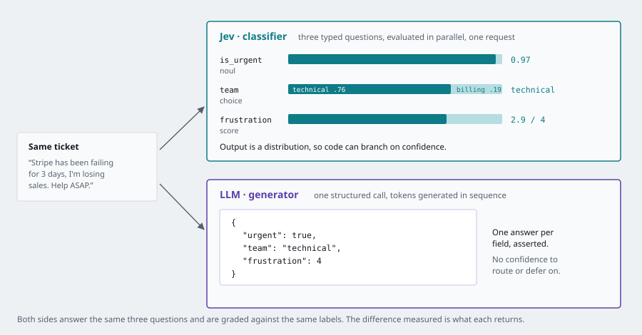
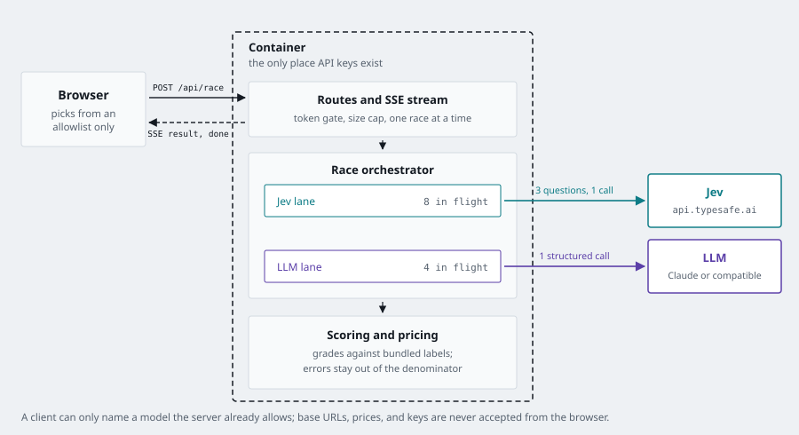

# Jev vs LLM: triage race
Created by Claude code

Race a **classifier** against a **language model** on the same job, and watch
speed, cost, and accuracy diverge in real time.

Both sides get the same support ticket and the same three questions — is it
urgent, which team owns it, how frustrated is the customer — and both are
graded against labels bundled with the repo. One side is
[Jev](https://docs.typesafe.ai/introduction), TypeSafe AI's System 1 model,
which returns typed probability distributions. The other is an LLM answering
with structured output.

<p align="center">
  
</p>

## Quickstart

You need a [TypeSafe API key](https://console.typesafe.ai/keys) and at least
one opponent key.

```bash
git clone https://github.com/Vybavnag/jev-triage-race.git
cd jev-triage-race
cp .env.example .env        # add TYPESAFE_API_KEY and ANTHROPIC_API_KEY
```

Then pick either way to run it. Both read `.env` themselves, so you never need
to export a key.

### With Docker

```bash
docker build -t jev-race .
docker run --rm --env-file .env -p 8000:8000 jev-race
```

Open <http://localhost:8000>. One container serves the API and the UI, which is
exactly what gets deployed.

### Without Docker

```bash
python3 -m venv .venv && .venv/bin/pip install -e ".[dev]"
cd web && npm install && cd ..

./dev
```

Open <http://localhost:5173>. `./dev` runs the API and the UI together with hot
reload on both, and Ctrl-C stops both. Override the ports with `API_PORT` or
`UI_PORT` if something else is using them.

Prefer a single process? Build the UI once and the API will serve it:

```bash
cd web && npm run build && cd ..
.venv/bin/uvicorn app.main:app        # everything on http://localhost:8000
```

## What a run looks like

15 tickets from the bundled set, Jev against Claude Sonnet 5, run from a laptop
on 2026-09-21:

| | Jev | Claude Sonnet 5 |
|---|---|---|
| Average latency per ticket | 313 ms | 2,054 ms |
| Cost for the run | $0.000313 | $0.027396 |
| Urgent | 93% | 80% |
| Team | 100% | 93% |
| Frustration (±1 level) | 93% | 100% |

About 6.6× the speed and 88× the cost difference, with accuracy close enough
that it splits by question rather than by model. Against Claude Haiku 4.5 the
speed gap narrows to roughly 2× and the cost gap to about 23×.

Treat these as one sample, not a benchmark: 15 synthetic tickets, one machine,
one moment. Latency includes network round trips from wherever you run it. The
point of the repo is that you can rerun it on your own data in a minute.

## What you are looking at

**Race** runs the bundled dataset through both sides at once. Each side has its
own concurrency budget so a slow LLM never throttles Jev, and the two tracks
fill independently — the gap between them is the whole point. Failed tickets
are counted separately and kept out of the accuracy denominator, so a rate
limit can never inflate a score.

When a race finishes, **route by confidence** appears: a threshold slider that
replays the finished run at any confidence bar you choose, showing how much
would have routed itself, how much would reach a person, and how many of the
auto-routed tickets went to the wrong team. Nothing is re-run — the per-ticket
probabilities are already in hand, so the answer recomputes as you drag. The
LLM side stays empty here, because it returns no confidence to gate on. That
absence is the point: its tickets are all-or-nothing.

**Playground** sends one message you write to both sides and shows the exact
request and response for each. This is where the difference in *kind* shows up.
Jev returns a probability for every team and every frustration level, drawn as
a distribution; the LLM returns one value per field with nothing to say how
close the call was.

## How the comparison is kept fair

Benchmarks are easy to rig, so here is every thumb that could have been on the
scale:

- **One request per message, per side.** No retry loops, no multi-step
  prompting, no self-consistency sampling on either side.
- **The LLM gets structured output**, not free text that would need parsing —
  its best shot at this task.
- **Claude runs at `effort: "low"`** with thinking left enabled. That is the
  setting a real classification workload would use. Disabling thinking is a
  known failure mode on Opus 5 and is deliberately avoided.
- **Automatic model fallbacks are off.** A refusal is recorded as an error, not
  silently answered by a different model.
- **Cost uses published per-token prices** — Jev at $0.042 per million input
  tokens with output free, each Claude model at its own rate. If a provider
  does not report usage, cost reads `unknown` rather than `$0`.
- **The dataset is synthetic and hand-labeled.** It is a smoke test, not a
  benchmark to cite. Swap in your own labeled tickets for a number that means
  something to you.

One asymmetry is real and worth naming: Jev answers all three questions in a
single parallel evaluation, which is what the model is built for. That is not a
handicap applied to the LLM — it is the architectural difference being measured.

## Scoring

| Question | Jev returns | Counted correct when |
|---|---|---|
| Urgent | probability in `[0, 1]` | `p >= 0.5` matches the label |
| Team | probability per option | highest-probability option matches |
| Frustration | weighted position on a 0-indexed scale | within one level of the label |

Jev's score is a probability-weighted float over zero-indexed levels, so a
five-level rubric returns `0.0`–`4.0`. The app maps that to 1–5 with
`floor(score + 0.5) + 1`, deliberately not Python's `round()`, which rounds
half-to-even and is non-monotonic at exactly `.5`.

## Configuration

Everything is server-side. The browser never sends a key, a base URL, or a
price — a client can only pick from an allowlist the server publishes.

| Variable | Default | Purpose |
|---|---|---|
| `TYPESAFE_API_KEY` | — | Required. |
| `ANTHROPIC_API_KEY` | — | Enables the Claude opponents. |
| `OPENAI_COMPAT_BASE_URL` / `_API_KEY` / `_MODEL` | — | Any OpenAI-compatible endpoint (OpenAI, Ollama, vLLM). |
| `OPENAI_COMPAT_PRICE_IN` / `_OUT` | — | $/MTok for the cost counter. Unset means cost shows `unknown`. |
| `RACE_TOKEN` | unset | Gate race starts behind a bearer token. |
| `RACE_MAX_ITEMS` | `25` | Hard server-side cap per race. |
| `JEV_CONCURRENCY` / `LLM_CONCURRENCY` | `8` / `4` | Per-side parallelism. |
| `TRUST_PROXY` | `false` | Honor `X-Forwarded-For` for rate limiting. |
| `ENV` | `dev` | Set to `prod` to disable `/docs`. |

### Before you expose it publicly

This app spends your API credits and ships with no authentication, because the
default assumption is that you are running it locally. Anyone who can reach an
unprotected instance can burn your quota. If you put it on the internet:

1. Set `RACE_TOKEN`. That gates race starts and cancels.
2. Set `ENV=prod` to close the docs endpoints.
3. Set a spend cap in your provider dashboards. That is the only limit nothing
   in this repo can bypass.

Without a token the app falls back to per-IP rate limiting (a burst of three
races, then one a minute) and allows only one race at a time. That is sized to
stay out of your way while demoing locally, and it is not enough to protect a
public deployment on its own.

## Deploying

The repo is application code only — no Terraform, no Helm, no CI config. It
builds to one container that serves both the API and the frontend, so any
platform that can run a Dockerfile can run it. The only thing this repo needs
to know about infrastructure is which port to listen on.

## Tests

```bash
pytest                       # 106 tests, coverage gate at 70%
cd web && npm test           # routing-gate math
cd web && npm run build      # tsc --noEmit plus the production build
```

The suite never touches a real API: provider adapters run against injected
fakes and `respx`-mocked transports. Notable cases include the score-mapping
boundaries, the accuracy denominator excluding errors, per-side concurrency
caps, cancellation actually cancelling in-flight calls, `Last-Event-ID` replay,
and a sweep asserting no API key appears in any response body or SSE frame.

## How it is built

<p align="center">
  
</p>

- `app/scoring.py`, `app/pricing.py` — pure functions, no I/O, the highest test coverage
- `app/classifiers/` — one adapter per provider behind a single `Classifier` protocol
- `app/race.py` — two `asyncio.TaskGroup`s, per-side semaphores, byte-bounded event buffer
- `app/routers/` — REST plus the SSE stream
- `web/` — React and TypeScript, no state library

Server-Sent Events carry the race rather than WebSockets: the traffic is
one-directional, `EventSource` reconnects on its own, and a plain HTTP response
passes through platform proxies without upgrade handling.

Race state lives in memory. Restarting the process loses history, which is
fine for a demo and deliberate — there is no database to run.